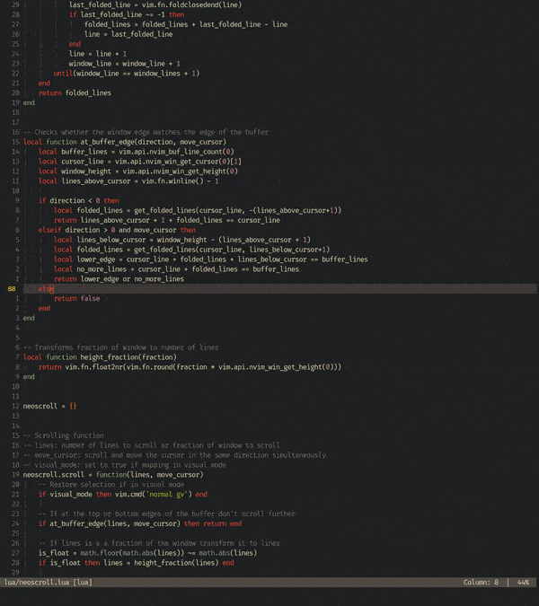

# Neoscroll: a simple smooth scrolling plugin written in lua




[High quality video](https://user-images.githubusercontent.com/41967813/113148268-93727b80-9229-11eb-993b-f55ad2bec808.mp4)


## Installation
You will need neovim 0.5 for this plugin to work
Install using your favorite plugin manager. If you use [Packer](https://github.com/wbthomason/packer.nvim):
```
use 'karb94/neoscroll.nvim'
```

## Features
* Smooth scrolling for window movement commands (optional): `<C-u>`, `<C-d>`, `<C-b>`, `<C-f>`, `<C-y>` and `<C-e>`.
* Takes into account folds.
* A single scrolling function that accepts either the number of lines or the percentage of the window to scroll.
* Cursor is hidden while scrolling (optional) for a more pleasing scrolling experience.
* Customizable scrolling behaviour.

## Known issues
* Scrolling might stop before reaching the top/bottom of the file when wrapped lines are present. Currently working on a solution.

## Acknowledgements
This plugin was inspired by [vim-smoothie](https://github.com/psliwka/vim-smoothie) and [neo-smooth-scroll.nvim](https://github.com/cossonleo/neo-smooth-scroll.nvim).
Big thank you to their authors!
